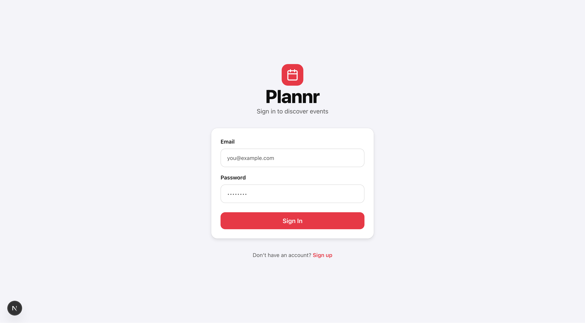
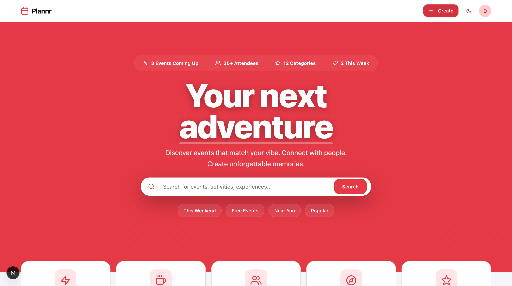
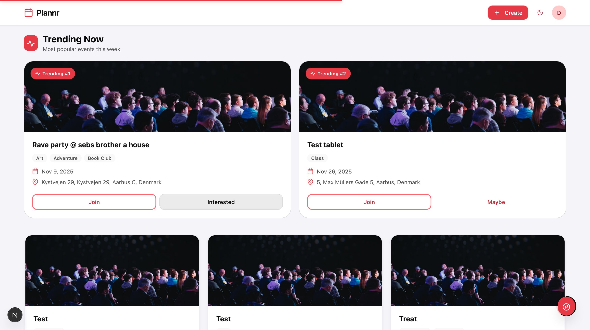
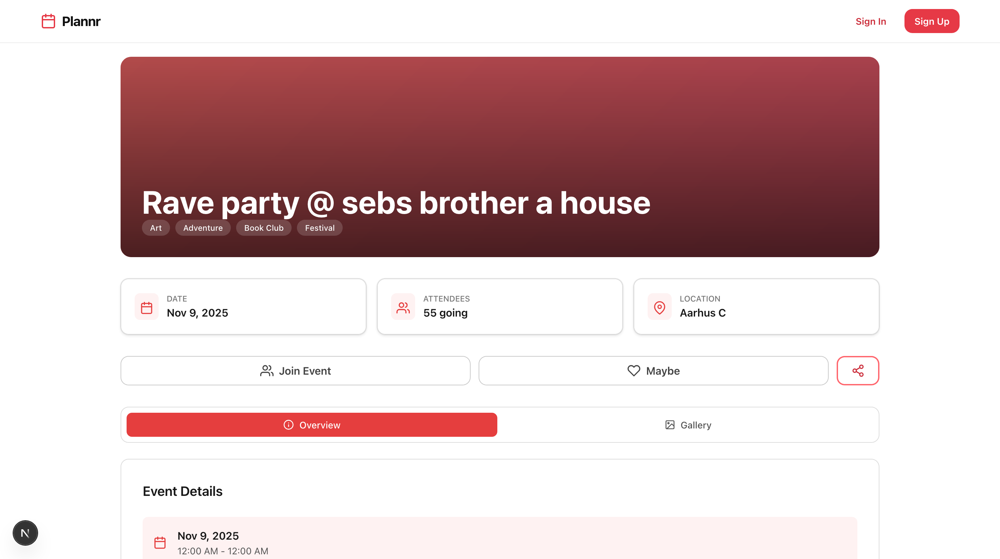
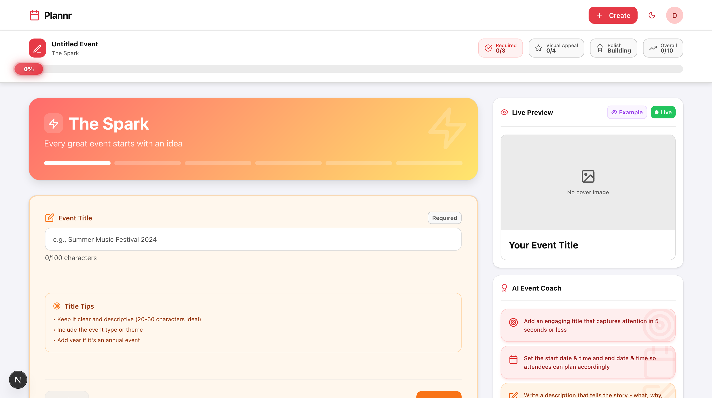
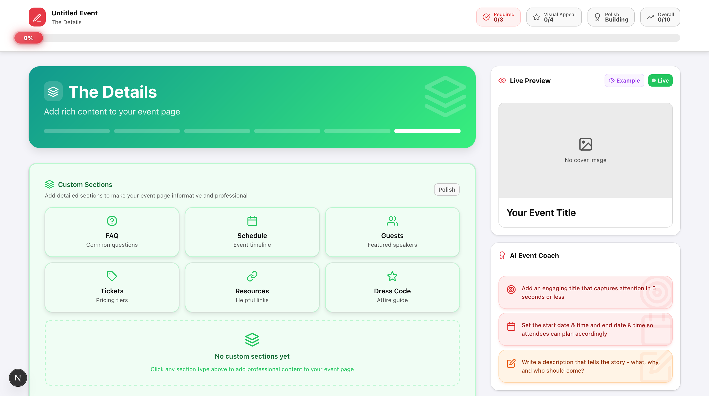
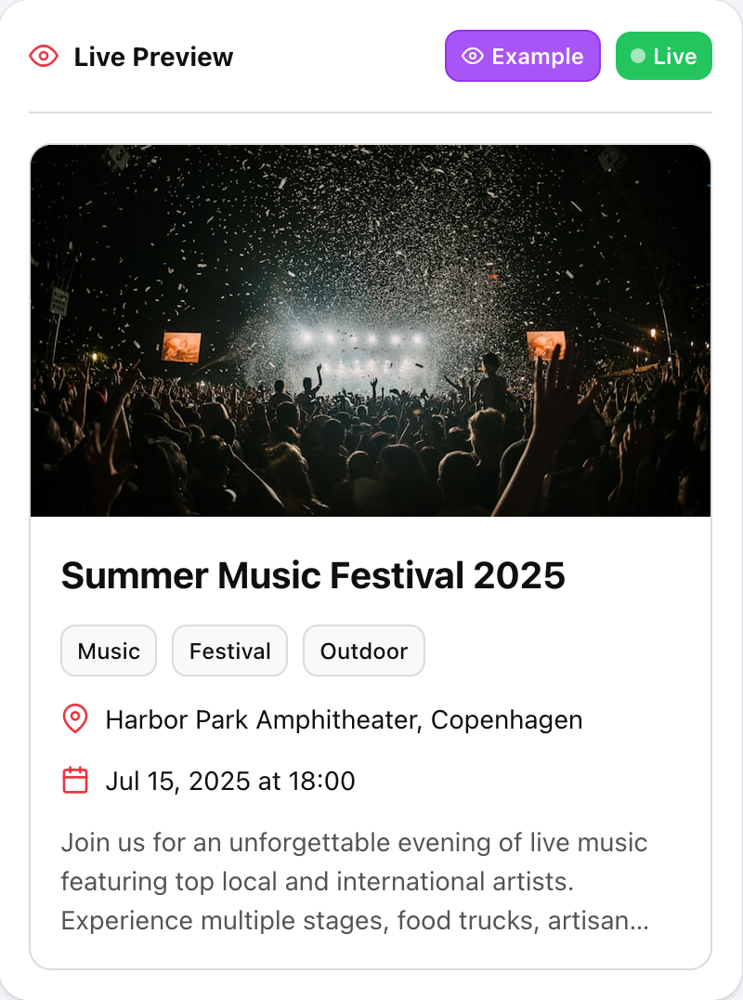
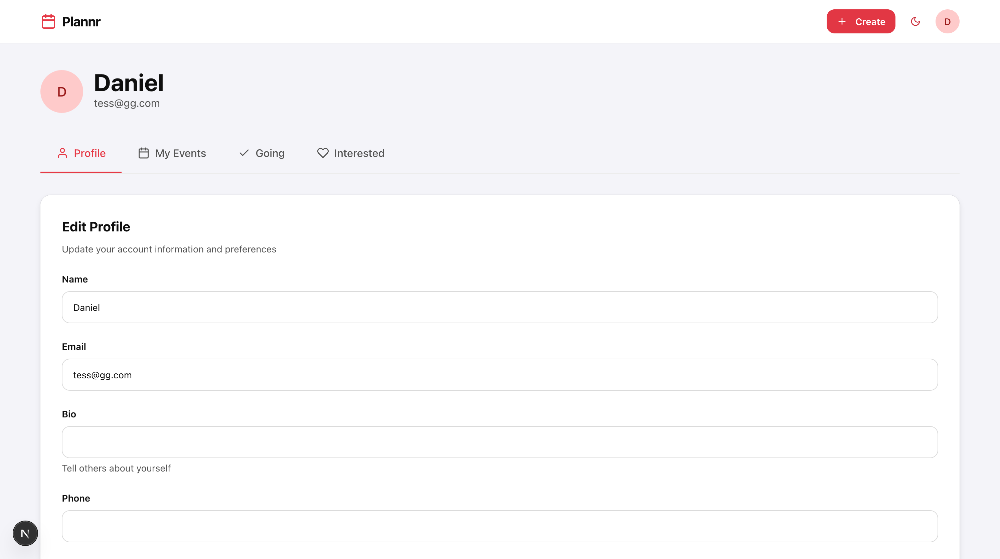

# Product Report: Plannr Event Platform

---

## 1. Product Overview

**Plannr** is a modern web application for discovering, creating, and managing events. The platform is designed with a focus on minimalism, accessibility, and a smooth user experience. It supports user authentication, event management, and profile features, and is built for future scalability (e.g., company/organization support).

---

## 2. Key Features

- **User Authentication:** Secure signup and login using NextAuth.
- **Event Discovery:** Browse, search, and filter events by mood, theme, or location.
- **Event Creation & Editing:** Multi-step, modular event creation with live preview and AI feedback.
- **Profile Management:** Users can view and edit their profile, and see their created and attended events.
- **Responsive UI:** Built with Chakra UI for accessibility and modern design.
- **Performance:** Skeleton loaders and optimistic UI updates for a fast, responsive feel.

---

## 3. Main User Flows (with Screenshots)

### a. Onboarding & Authentication

- Users sign up or log in with email and password.
- Auth state is managed and users are redirected appropriately.

---

### b. Event Discovery

- Home page shows featured and upcoming events.
- Users can search, filter, and view event details.

---

### c. Event Details

- Shows full event info, images, location, and RSVP options.

---

### d. Event Creation & Editing (Step-by-Step)

#### Step 1: Start Event Creation

- User clicks to start creating a new event.

#### Step 2: Fill Event Details

- User enters title, description, date, and location.

#### Step 3: Add Timeline/Sections

- User adds schedule, agenda, or sections for the event.

#### Step 4: Live Preview & Suggestions

- User sees a live preview and receives suggestions to improve the event (not AI-powered).

#### Step 5: Submit Event

- User submits the event, which is now visible in the events list.

---

### e. Profile & Account Management

- Users can view and edit their profile.
- Tabs allow switching between profile info, created events, and events they are attending/interested in.

---

## 4. Technical Architecture

- **Frontend:** Next.js 15 (App Router), React 19, Chakra UI, Framer Motion.
- **Backend:** ASP.NET Core Web API, Entity Framework Core, PostgreSQL.
- **State & Auth:** React Context, NextAuth.
- **API:** Next.js API routes proxy to backend.
- **Testing & Storybook:** Storybook for UI, Vitest for testing.
- **Feature-based Structure:** Code is organized by domain features for scalability.

---

## 5. Unused/Planned Features

- **Companies/Organizations:** The backend supports companies (organizations that can own events and have users), but this feature was not implemented in the UI due to time constraints. The groundwork is present for future expansion.

---

## 7. Reflection

### What Went Well

- Feature-based folder structure made the codebase scalable and maintainable.
- Chakra UI and Next.js App Router enabled rapid development and a modern, accessible UI.
- Modular event creation flow with live preview and AI feedback improved user experience.

### Challenges

- Integrating authentication and session management required careful handling.
- Ensuring accessibility and high contrast across all components took extra effort.
- Time constraints meant some features (like companies) were not implemented in the UI.

### Lessons Learned

- Planning folder structure and code modularity from the start is crucial.
- Focus on core flows for MVP; leave advanced features for future iterations.
- User feedback and iterative design are valuable, especially for complex flows.

### Next Steps

- Add more automated tests for critical flows.
- Integrate analytics for user insights.
- Continue improving accessibility and performance.
- Consider implementing company/organization features in the future.

---

## 8. Conclusion

Plannr is a robust foundation for a scalable event platform, with a modern tech stack and thoughtful architecture. The project demonstrates best practices in modularity, accessibility, and user-centered design, while also showing the importance of prioritization and scope management in real-world development.
